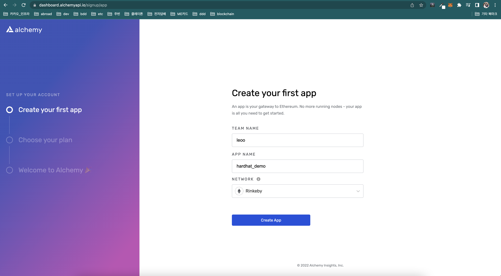
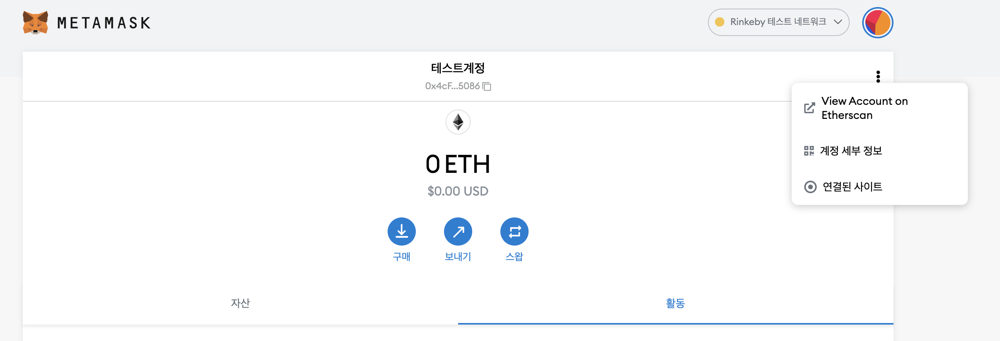
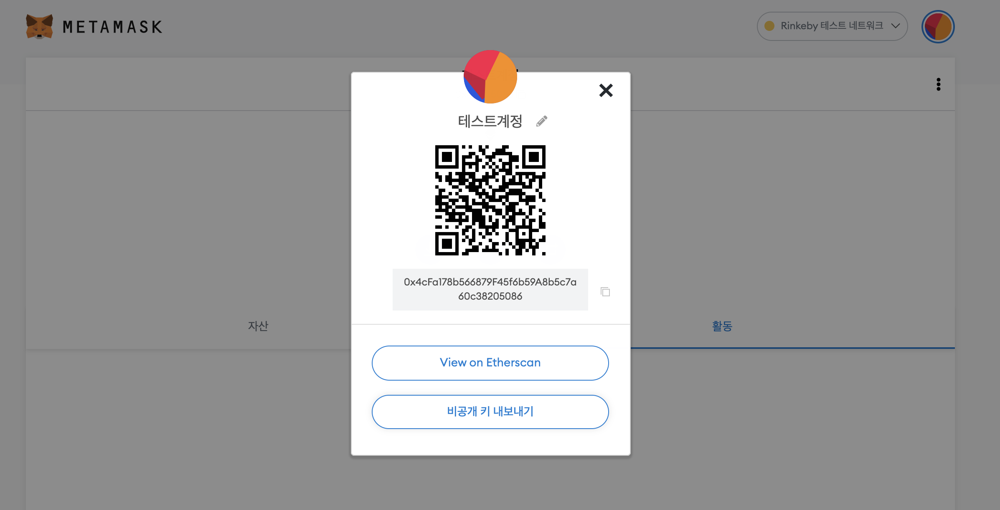
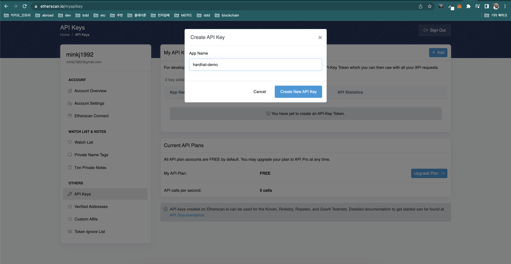
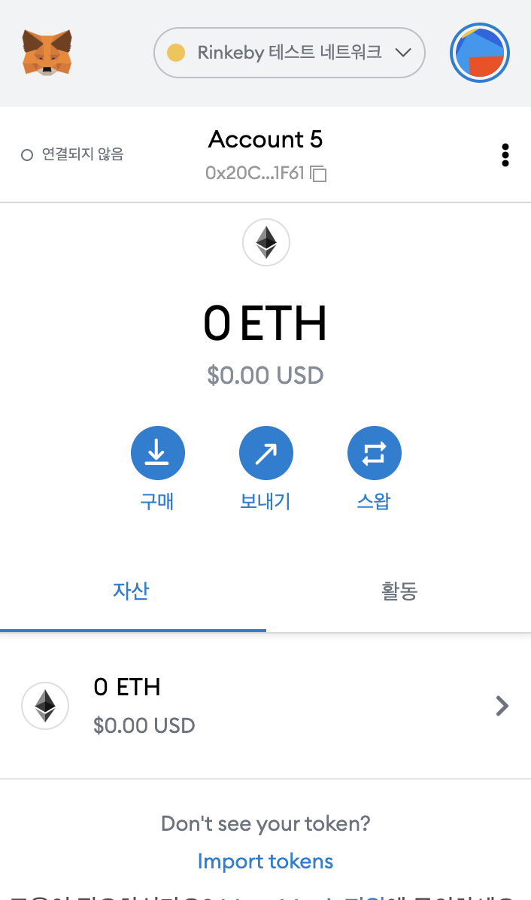
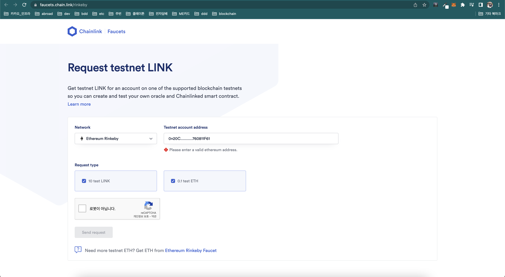
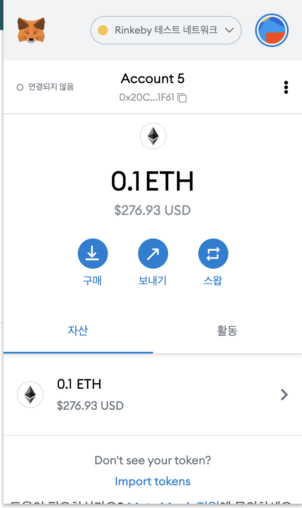
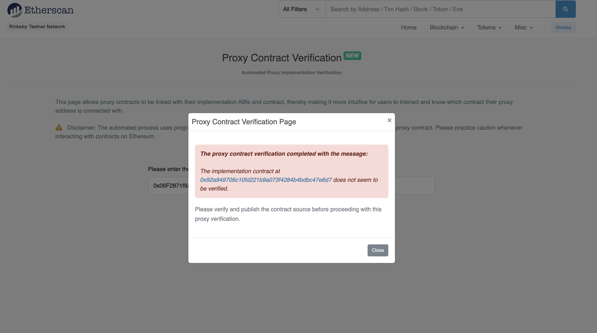

# Simple Storage Upgradable

> [ref](https://www.inflearn.com/course/%EB%94%94%EC%95%B1-%ED%95%98%EB%93%9C%ED%96%87-%EC%98%A4%ED%94%88%EC%A0%9C%ED%8E%A0%EB%A6%B0)

`hardhat`과 `openzeppelin` 환경에서 간단한 Upgradable contract를 생성해봅니다.

## init

```shell
$ yarn init -y
$ yarn add hardhat --dev
$ yarn add @openzeppelin/hardhat-upgrades --dev
```

## test

```shell
$ npx hardhat test
```

## deploy

- `ganache`같은 내부 노드 실행

```shell
$ npx hardhat node
```

- deploy

```shell
$ npx hardhat run --network localhost ./scripts/SimpleStorageUpgrade.deploy.js
SimpleStorageUpgrade deployed to: 0x9fE46736679d2D9a65F0992F2272dE9f3c7fa6e0
```

- check

```shell
$ npx hardhat console --network localhost

Welcome to Node.js v14.15.1.
Type ".help" for more information.
> const f = await ethers.getContractFactory("SimpleStorageUpgrade")
undefined
> const ssu = await f.attach("0x9fE46736679d2D9a65F0992F2272dE9f3c7fa6e0")
undefined
> ssu.address
'0x9fE46736679d2D9a65F0992F2272dE9f3c7fa6e0'
> (await ssu.get()).toString()
'500'
> let tx = await ssu.set(1000)
undefined
> (await ssu.get()).toString()
'1000'
```

- upgrade contract version

```shell
$ npx hardhat run --network localhost ./scripts/SimpleStorageUpgradeV2.deploy.js
Compiling 1 file with 0.8.4
Solidity compilation finished successfully
SimpleStorageUpgrade version 2 deployed to: 0x9fE46736679d2D9a65F0992F2272dE9f3c7fa6e0
```

## deploy to remote network

> [hardhat docs](https://hardhat.org/config/)

#### hardhat.config.js

```js
require("dotenv").config(); // yarn add dotenv

// ... 중략 ...

module.exports = {
  networks: {
    rinkeby: {
      url: `https://eth-rinkeby.alchemyapi.io/v2/${process.env.ALCHEMY_API_KEY}`,
      // 0x20CE8B2190949f48F5D32d5BbbfE7E3760811F61
      accounts: [process.env.TEST_ACCOUNT_PRIVATE_KEY],
    },
  },
  solidity: "0.8.4",

  etherscan: {
    apiKey: process.env.ETHERSCAN_API_KEY,
  },
};
```

- `ALCHEMY_API_KEY`: [alchemy](https://www.alchemyapi.io)에서 demo app을 생성하게 될 경우 view key를 하면 확인가능합니다.



- `TEST_ACCOUNT_PRIVATE_KEY`: metamask에서 `rinkeby` 네트워크에 계정을 생성한 뒤 아래와 같이 비공개키 export를 누르면 확인 가능합니다.




- `ETHERSCAN_API_KEY`
  1. [register etherscan](https://etherscan.io/register)에서 회원 가입을 한 뒤
  2. [create etherscan api key](https://etherscan.io/myapikey)에서 `My API Keys` > `+ Add`해주어서 얻어줍니다.



추가로 [rinkeby faucet](https://faucets.chain.link/)에 들어가게되면 address 기반으로 rinkeby 계정에 이더를 넣어줄 수 있습니다.





### deploy to `rinkeby`

```shell
$ npx hardhat run --network rinkeby ./scripts/SimpleStorageUpgrade.deploy.js
SimpleStorageUpgrade deployed to: 0x06F2871f9A193762f0D104809b579b241508e312
```

테스트넷이기 때문에 약간의 시간이 소요됩니다. (약 30초) 이후 deploy된 address는 [rinkeby etherscan](https://rinkeby.etherscan.io/)에서 확인가능합니다.

- https://rinkeby.etherscan.io/address/0x06F2871f9A193762f0D104809b579b241508e312




> The implementation contract at 0x92a949706c10fd221b9a073f4284b4bdbc47e6d7 does not seem to be verified.

아직 implementation이 검증되지 않았다고 뜬다. 이렇게 proxy가 아닌 implementation contract를 검증해주기 위해서는 아래와 같이 추가 작업해주면 됩니다.

```shell
$ yarn add @nomiclabs/hardhat-etherscan --dev
```
